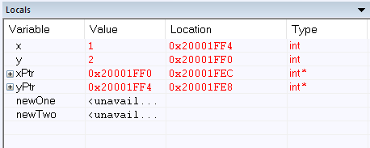
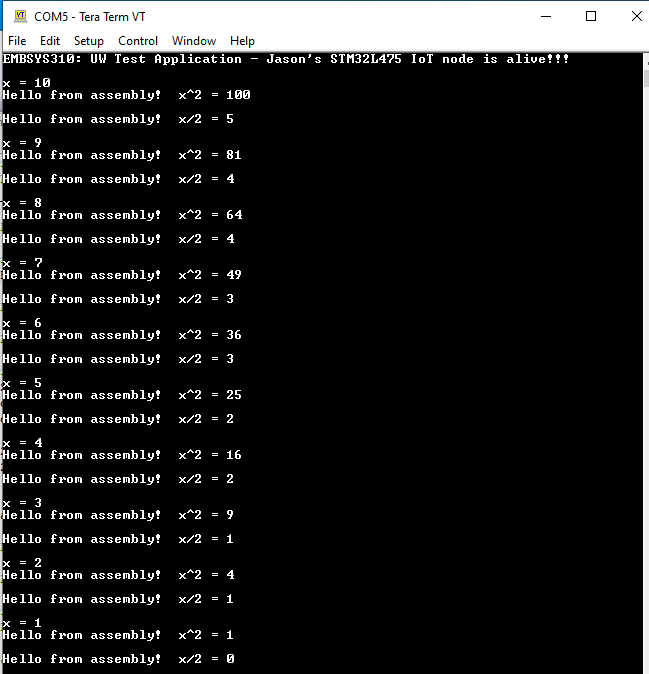

Assignment 05

1.	a. The instructions were very unexpected to me, so I thought this was interesting:
	First, registers R3-R7 were pushed to the stack, though they all had blank values to start.
	Next, my first variable (x) was created and its value pushed to one of the spots on the stack.
	Same with my second variable (y).
	I then made pointers to each of these variables (xPtr, yPtr) and the pointer values were pushed to the stack.
	
	b. When swap_pointer is called, R0 is set to one argument (xPtr), and R1 is set to the other (yPtr).  Then the branch to the swap_pointer function occurs.
	
	c. Screenshot attached.
	
	
2.	Code and screenshot attached.  I also left the code in the Hello World sample that squared the counter.  The code is in file divAsm.s.

3.	Code and screenshot attached.  Driver code is in main.c and assembly code is swapCharsAsm.s.